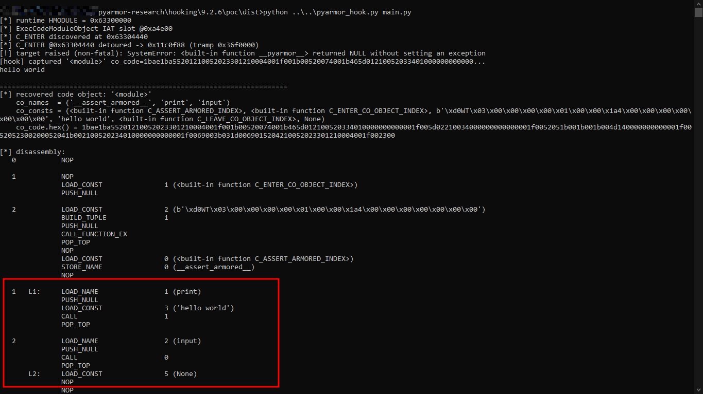

# PyArmor 9.2.6: Hooking Research

## What it does

`pyarmor_hook.py` loads `pyarmor_runtime_000000/pyarmor_runtime.pyd`, locates the runtime function that decrypts protected function bytecode, detours it, and snapshots the resulting Python code object before re-encryption. Target is the PyArmor 9.2.6 trial build on Windows.

## How it was done

The hook resolves `C_ENTER_CO_OBJECT_INDEX`, installs an inline detour, calls the original function through a trampoline, and snapshots the resulting `PyCodeObject` before its `co_code` is re-encrypted. It operates inside the target process; it does not attach through an external debugger.

## What came out

- Protected function bytecode is decrypted in place immediately before execution and re-encrypted after the function returns.
- `C_ENTER_CO_OBJECT_INDEX` is the runtime entry point associated with this decryption step.
- Runtime captures exposed two discrepancies in the static reconstruction:
  - native `PyCFunction` objects were being treated as ordinary reconstructable constants;
  - the constants-tuple can contain more entries than its declared length, with additional entries following the declared tuple.
- A capture of `dist/main.py` matched the static reconstruction field-by-field except for the known runtime-only native objects described in the static analysis.

## What's fragile

- Windows only; Linux `.so` builds are not covered by this implementation. Python 3.10 through 3.14, matching the target file's Python version.
- Only code reached during the capture run is observed.
- A parent code object's constants can contain a child function's re-encrypted bytecode after the child has executed. Use the child's own capture when comparing its plaintext bytecode.
- The first 8 bytes of a small internal descriptor are a live pointer value. They are zeroed at rest and are not recoverable from the file alone.
- The implementation depends on the layout and behavior of the PyArmor 9.2.6 runtime. A different release may change the location or implementation of `C_ENTER_CO_OBJECT_INDEX`, the import-table layout, the machine-code prologue used by the detour, or the structure of runtime-created objects. Do not assume this hook works unchanged against another version.

## How to run it

Runs on Windows with Python 3.10 through 3.14, matching the target file's Python version. Runtime is `pyarmor_runtime_000000\pyarmor_runtime.pyd`; the hook operates inside the target process and does not require a separate debugger.

PoC target: Windows 10, Python 3.14, hello-world sample. `pyarmor_hook.py` run end to end against the hello-world target:

Files:
- `pyarmor_hook.py`: runtime hook and CLI.
- [`HOW_IT_WORKS.md`](HOW_IT_WORKS.md): implementation details and decompiled runtime code.