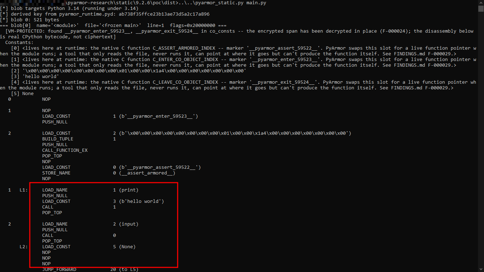

# PyArmor 9.2.6: Static Research

## What it does

`pyarmor_static.py` reconstructs Python code objects from a protected PyArmor 9.2.6 trial build without executing either input. It reads the protected `.py` file and `pyarmor_runtime.pyd` as raw bytes, derives the AES-128 key used by the runtime, decrypts the embedded blob, and rebuilds the code objects offline.

## How it was done

The blob records its target Python version, and the tool re-executes under the matching interpreter because Python's internal code-object and `marshal` layouts changed starting with 3.11.

Recovery pipeline:

1. Locate the `__pyarmor__(...)` blob.
2. Derive the key from `pyarmor_runtime.pyd`.
3. Decrypt the blob's declared ciphertext span.
4. Parse the result as CPython `marshal`.
5. Rebuild `types.CodeType` objects.
6. Detect protected functions and decrypt their inner spans.
7. Disassemble the reconstructed code objects.

IDA was used during format analysis but is not required to run `pyarmor_static.py`.

## What came out

### Key derivation

The runtime key is:

```text
MD5(salt || embedded_pubkey_blob || signed_license_descriptor || deobfuscated_constant)
```

The four inputs are embedded in `pyarmor_runtime.pyd` relative to the `b"pyarmor-vax-"` marker. The derivation was checked against runtime-captured key material.

### Encryption

The runtime uses AES-GCM for decryption but does not perform the GCM tag verification step. `pyarmor_static.py` therefore validates the decrypted plaintext using two expected values rather than relying on a GCM authentication result.

### Per-function encrypted spans

Protected functions contain an encrypted span inside `co_code`. The span is ordinary CPython bytecode after decryption. Its location, length, and IV are described by a 20-byte descriptor stored in the function's constants.

### Native runtime hooks

Three helper objects per protected function remain execution-only: tamper-check, entry marker, and exit marker. They are native `PyCFunction` objects created by the runtime after module initialization and cannot be reconstructed from the protected file alone.

### Format quirks

The blob contains a type tag of `8` or `9`. All samples tested so far use tag `8`; tag `9` is implemented from the decompiled branch logic but has not been tested against a real file.

The constants tuple can declare fewer entries than are actually present. Additional entries follow the declared tuple without another tuple header. `_read_consts_then_names()` detects this case and continues consuming constants until the following object matches the expected names-tuple structure.

## What's fragile

The findings on this page are specific to the tested PyArmor 9.2.6 build. The tool is coupled to the target's Python version: code-object and `marshal` layouts changed starting with 3.11, so it must run under the matching interpreter.

The following may change between releases:

- key-derivation inputs;
- embedded marker locations;
- blob headers;
- per-function descriptors;
- native runtime entry points;
- marshal reconstruction behavior.

Validate every new release independently. Native helper objects cannot be statically reconstructed, blob tag `9` is unverified against a real sample, and the key-derivation recipe is build-specific.

## How to run it

Requires Python 3.10 through 3.14, matching the target file's Python version, and `pycryptodome` for AES-GCM.

PoC target: Windows 10, Python 3.14, hello-world sample. `pyarmor_static.py` run end to end against the hello-world target:



### Files

- `pyarmor_static.py`: offline reconstruction tool.
- [`HOW_IT_WORKS.md`](HOW_IT_WORKS.md): implementation details and supporting runtime analysis.